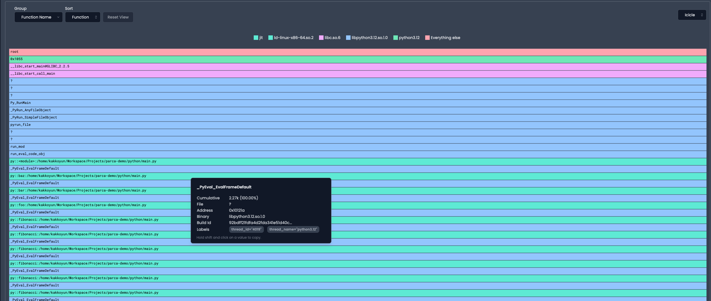
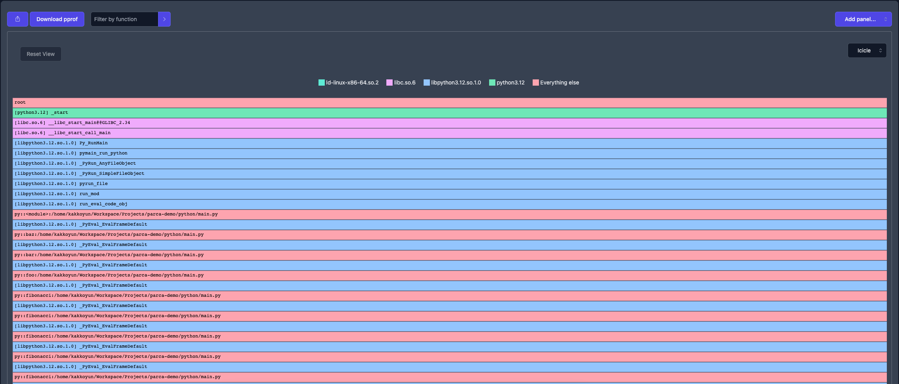

# Python

Every Python version from 2.6 until 3.12 is supported, if you ever run into anything, please open an issue.

## Demo





## Run

### On host

```shell
python3.12 python/main.py
```

### In Docker

```shell
docker build -t parca-demo:python-no-frame-pointer -f Dockerfile.no_frame_pointer .
```
